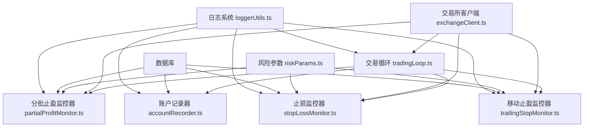
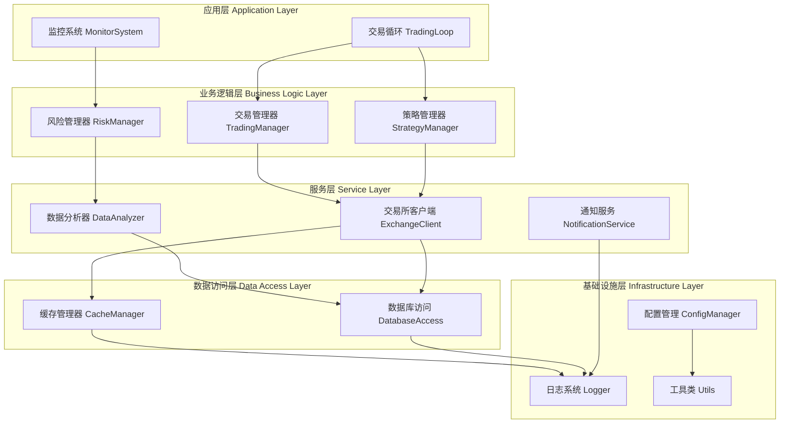

# 蔡森策略集成开发计划

## 目录

1. [项目概述](#项目概述)
2. [现有系统架构分析](#现有系统架构分析)
3. [蔡森策略分析](#蔡森策略分析)
4. [集成方案设计](#集成方案设计)
5. [开发阶段规划](#开发阶段规划)
6. [未来扩展功能](#未来扩展功能)
7. [实施时间表](#实施时间表)

## 项目概述

### 项目目标

将蔡森策略集成到现有的 nof1.ai AI 加密货币自动交易系统中，利用其多时间框架分析、七分位策略引擎和滞后性补偿机制，提升系统在波动市场中的表现。

### 技术栈

- 框架：VoltAgent
- 数据库：LibSQL
- Web 服务器：Hono
- 开发语言：TypeScript + Node.js 20+
- 编码格式：UTF-8

## 现有系统架构分析

### 1. 策略系统架构

#### 1.1 策略类型系统 (`src/strategies/types.ts`)

- **功能**：定义了 11 种交易策略类型及核心接口
- **核心接口**：
  - `StrategyParams`：策略参数配置接口
  - `StrategyPromptContext`：策略提示词上下文接口
- **策略类型**：conservative、aggressive、balanced、swingTrend、ultraShort、mediumLong、alphaBeta、aiAutonomous、multiAgentConsensus、aggressiveTeam、rebateFarming

#### 1.2 策略管理器 (`src/strategies/index.ts`)

- **功能**：统一导出各策略实现及相关函数
- **核心方法**：
  - `getStrategyParams()`：获取策略参数
  - `generateStrategySpecificPrompt()`：生成策略特定提示词
- **扩展点**：可轻松添加新策略类型

#### 1.3 现有策略实现分析

**激进策略 (`src/strategies/aggressive.ts`)**

- 风险等级：高风险
- 杠杆范围：85%-100%最大杠杆
- 仓位大小：25%-32%
- 特点：高杠杆、高回报、高风险

**AI 自主策略 (`src/strategies/aiAutonomous.ts`)**

- 风险等级：完全由 AI 自主决定
- 杠杆范围：1-最大杠杆（AI 完全自主选择）
- 仓位大小：1-100%（AI 完全自主选择）
- 特点：双重防护机制（代码级保护+AI 主动决策）

**陪审团策略 (`src/strategies/multiAgentConsensus.ts`)**

- 风险等级：中等风险
- 杠杆范围：55%-80%最大杠杆
- 仓位大小：20%-30%
- 特点：法官与陪审团合议决策模式

### 2. 代理系统架构

#### 2.1 交易代理 (`src/agents/tradingAgent.ts`)

- **功能**：核心交易决策与执行
- **关键组件**：
  - 账户风险配置
  - 策略参数获取
  - 交易提示词生成
  - 交易工具集成

#### 2.2 分析代理 (`src/agents/analysisAgents.ts`)

- **功能**：提供多维度市场分析
- **代理类型**：
  - 技术分析代理
  - 趋势分析代理
  - 风险评估代理

#### 2.3 激进团队代理 (`src/agents/aggressiveTeamAgents.ts`)

- **功能**：专门为激进策略设计的多代理协作系统
- **代理角色**：
  - 趋势分析专家（团员 1）
  - 预测分析专家（团员 2）
  - 团长（主代理）

### 3. 调度系统架构

#### 3.1 交易循环 (`src/scheduler/tradingLoop.ts`)

- **功能**：定时执行交易决策
- **执行频率**：可配置（默认每分钟执行一次）
- **核心流程**：
  1. 收集市场数据
  2. 验证数据有效性
  3. 生成交易提示词
  4. 执行交易决策

#### 3.2 监控系统

**止损监控器 (`src/scheduler/stopLossMonitor.ts`)**

- **功能**：每 10 秒监控持仓盈亏，自动执行止损
- **特点**：根据杠杆倍数动态调整止损阈值

**账户记录器 (`src/scheduler/accountRecorder.ts`)**

- **功能**：每 10 分钟记录账户资产（包含未实现盈亏）
- **数据**：总资产、可用余额、未实现盈亏、已实现盈亏、回报率

## 蔡森策略分析

### 1. 策略核心组件

#### 1.1 多时间框架分析器

- **功能**：整合 1 分钟、5 分钟、15 分钟、1 小时、4 小时和日线数据
- **特点**：提供全面的市场视角，识别短期和长期趋势

#### 1.2 七分位策略引擎

- **功能**：将市场状态分为七个等级，提供精细化的交易决策
- **等级划分**：极看空、看空、偏空、中性、偏多、看多、极看多

#### 1.3 动态仓位管理器

- **功能**：根据市场波动率和信号强度动态调整仓位
- **特点**：在震荡市场降低仓位，趋势市场增加仓位

#### 1.4 滞后性补偿器（优化版）

- **功能**：应对数据延迟问题，提高策略实时性
- **核心机制**：
  - 滞后补偿：预测当前可能价格
  - 市场过滤：排除不适合交易的市场条件
  - 策略调整：根据滞后程度调整参数

### 2. 策略计算公式

#### 2.1 多时间框架趋势得分

```
趋势得分 = (1分钟权重 × 1分钟信号) + (5分钟权重 × 5分钟信号) + ... + (日线权重 × 日线信号)
```

#### 2.2 七分位市场状态

```
市场状态 = 标准化(趋势得分 + 波动率调整 + 成交量确认)
```

#### 2.3 动态仓位计算（含滞后性补偿）

```
基础仓位 = 市场状态映射的基础仓位
波动率调整 = 基础仓位 × (1 - 波动率系数 × 当前波动率)
信号强度调整 = 波动率调整后仓位 × 信号强度系数
滞后性补偿 = 信号强度调整后仓位 × (1 + 滞后补偿系数)
最终仓位 = min(最大仓位限制, 滞后性补偿后仓位)
```

#### 2.4 动态止损止盈（含滞后性补偿）

```
基础止损 = 入场价格 × (1 - 基础止损率)
波动率调整止损 = 基础止损 × (1 + 波动率止损调整系数)
滞后性调整止损 = 波动率调整止损 × (1 - 滞后止损调整系数)
最终止损 = max(最低止损要求, 滞后性调整止损)
```

### 3. 策略优势与特点

1. **多时间框架整合**：避免单一时间框架的局限性
2. **精细化市场分级**：七分位提供更精确的市场状态描述
3. **动态仓位管理**：根据市场条件自适应调整
4. **滞后性补偿**：提高策略在数据延迟环境下的有效性
5. **全面风险控制**：多层次止损止盈机制

## 集成方案设计

### 1. 策略集成架构

#### 1.1 创建蔡森策略模块

- **文件路径**：`src/strategies/caiSen.ts`
- **功能**：实现蔡森策略的参数配置和提示词生成
- **核心接口**：
  - `getCaiSenStrategy(maxLeverage: number): StrategyParams`
  - `generateCaiSenPrompt(params: StrategyParams, context: StrategyPromptContext): string`

#### 1.2 创建蔡森分析代理

- **文件路径**：`src/agents/caiSenAnalysisAgents.ts`
- **功能**：实现蔡森策略特有的多时间框架分析和七分位评估
- **代理类型**：
  - 多时间框架分析代理
  - 七分位策略引擎代理
  - 滞后性补偿代理

#### 1.3 创建蔡森监控器

- **文件路径**：`src/scheduler/caiSenMonitor.ts`
- **功能**：实现蔡森策略特有的监控逻辑
- **监控内容**：
  - 多时间框架趋势变化监控
  - 市场状态等级变化监控
  - 滞后性补偿效果监控

### 2. 数据结构扩展

#### 2.1 策略类型扩展

- **修改文件**：`src/strategies/types.ts`
- **扩展内容**：
  ```typescript
  export type TradingStrategy =
    | "conservative"
    | "aggressive"
    | "balanced"
    | "swingTrend"
    | "ultraShort"
    | "mediumLong"
    | "alphaBeta"
    | "aiAutonomous"
    | "multiAgentConsensus"
    | "aggressiveTeam"
    | "rebateFarming"
    | "caiSen"; // 新增蔡森策略
  ```

#### 2.2 策略参数接口扩展

- **修改文件**：`src/strategies/types.ts`
- **扩展内容**：为蔡森策略添加特有参数

  ```typescript
  export interface StrategyParams {
    // ... 现有参数 ...

    // 蔡森策略特有参数
    caiSenConfig?: {
      timeFrameWeights: Record<string, number>; // 各时间框架权重
      sevenLevelThresholds: number[]; // 七分位阈值
      lagCompensationFactor: number; // 滞后补偿系数
      volatilityAdjustmentFactor: number; // 波动率调整系数
    };
  }
  ```

### 3. 核心实现方案

#### 3.1 蔡森策略参数实现

- **风险等级**：中等风险（可配置）
- **杠杆范围**：30%-70%最大杠杆
- **仓位大小**：15%-25%
- **特点**：多时间框架分析、七分位决策、滞后性补偿

#### 3.2 蔡森策略提示词设计

- **结构**：
  1. 策略核心理念说明
  2. 多时间框架分析指导
  3. 七分位策略引擎使用说明
  4. 滞后性补偿机制说明
  5. 动态仓位管理指导
  6. 风险控制规则

#### 3.3 蔡森分析代理实现

- **多时间框架分析代理**：

  - 分析 1 分钟、5 分钟、15 分钟、1 小时、4 小时和日线数据
  - 计算各时间框架趋势得分
  - 生成综合趋势评估

- **七分位策略引擎代理**：

  - 评估市场当前状态等级
  - 提供对应的交易建议
  - 动态调整仓位和风险参数

- **滞后性补偿代理**：

  - 评估当前数据滞后程度
  - 计算滞后补偿系数
  - 调整交易参数以应对滞后

### 4. 集成流程

#### 4.1 策略注册

- **修改文件**：`src/strategies/index.ts`
- **修改内容**：

  ```typescript
  // 导入蔡森策略
  import { getCaiSenStrategy, generateCaiSenPrompt } from "./caiSen";

  // 在getStrategyParams函数中添加蔡森策略
  export function getStrategyParams(
    strategy: TradingStrategy,
    maxLeverage: number
  ): StrategyParams {
    switch (strategy) {
      // ... 现有策略 case ...
      case "caiSen":
        return getCaiSenStrategy(maxLeverage);
      default:
        throw new Error(`Unknown strategy: ${strategy}`);
    }
  }

  // 在generateStrategySpecificPrompt函数中添加蔡森策略
  export function generateStrategySpecificPrompt(
    strategy: TradingStrategy,
    params: StrategyParams,
    context: StrategyPromptContext
  ): string {
    switch (strategy) {
      // ... 现有策略 case ...
      case "caiSen":
        return generateCaiSenPrompt(params, context);
      default:
        throw new Error(`Unknown strategy: ${strategy}`);
    }
  }
  ```

#### 4.2 交易循环集成

- **修改文件**：`src/scheduler/tradingLoop.ts`
- **修改内容**：确保蔡森策略可以正确加载和执行

#### 4.3 监控系统集成

- **修改文件**：`src/scheduler/stopLossMonitor.ts`
- **修改内容**：支持蔡森策略的特定止损规则

## 开发阶段规划

### 第一阶段：基础框架搭建（预计 2-3 天）

#### 任务 1.1：创建蔡森策略基础文件

- [x] 创建 `src/strategies/caiSen.ts` 文件
- [x] 实现基础策略参数配置
- [x] 实现基础提示词生成函数
- [x] 执行 `npm run typecheck` 确保无类型错误

#### 任务 1.2：扩展策略类型系统

- [x] 修改 `src/strategies/types.ts` 添加蔡森策略类型
- [x] 扩展 StrategyParams 接口支持蔡森特有参数
- [x] 执行 `npm run typecheck` 确保无类型错误

#### 任务 1.3：注册蔡森策略

- [x] 修改 `src/strategies/index.ts` 注册蔡森策略
- [x] 测试策略参数获取功能
- [x] 测试提示词生成功能
- [x] 执行 `npm run typecheck` 确保无类型错误

### 第二阶段：核心功能实现（预计 3-4 天）

#### 任务 2.1：实现多时间框架分析

- [x] 创建 `src/agents/caiSenAnalysisAgents.ts` 文件
- [x] 实现多时间框架分析代理
- [x] 实现趋势得分计算逻辑
- [x] 测试多时间框架数据整合
- [x] 执行 `npm run typecheck` 确保无类型错误

#### 任务 2.2：实现七分位策略引擎

- [x] 实现七分位策略引擎代理
- [x] 实现市场状态评估逻辑
- [x] 实现七分位阈值判断
- [x] 测试市场状态分级准确性
- [x] 执行 `npm run typecheck` 确保无类型错误

#### 任务 2.3：实现滞后性补偿机制

- [x] 实现滞后性补偿代理
- [x] 实现滞后程度评估逻辑
- [x] 实现补偿系数计算
- [x] 测试滞后性补偿效果
- [x] 执行 `npm run typecheck` 确保无类型错误

#### 任务 2.4：完善策略提示词

- [x] 完善蔡森策略提示词内容
- [x] 整合多时间框架分析指导
- [x] 整合七分位策略使用说明
- [x] 整合滞后性补偿机制说明
- [x] 测试提示词生成效果
- [x] 执行 `npm run typecheck` 确保无类型错误

### 第三阶段：监控系统实现（预计 2-3 天）

#### 任务 3.1：创建蔡森监控器

- [ ] 创建 `src/scheduler/caiSenMonitor.ts` 文件
- [ ] 实现多时间框架趋势变化监控
- [ ] 实现市场状态等级变化监控
- [ ] 实现滞后性补偿效果监控
- [ ] 测试监控器功能
- [ ] 执行 `npm run typecheck` 确保无类型错误

#### 任务 3.2：集成止损监控

- [ ] 修改 `src/scheduler/stopLossMonitor.ts` 支持蔡森策略
- [ ] 实现蔡森策略特定止损规则
- [ ] 测试止损监控功能
- [ ] 执行 `npm run typecheck` 确保无类型错误

#### 任务 3.3：集成交易循环

- [ ] 修改 `src/scheduler/tradingLoop.ts` 支持蔡森策略
- [ ] 测试蔡森策略在交易循环中的执行
- [ ] 验证数据收集和处理流程
- [ ] 执行 `npm run typecheck` 确保无类型错误

### 第四阶段：测试与优化（预计 2-3 天）

#### 任务 4.1：单元测试

- [ ] 编写蔡森策略参数测试
- [ ] 编写多时间框架分析测试
- [ ] 编写七分位策略引擎测试
- [ ] 编写滞后性补偿测试
- [ ] 修复发现的问题
- [ ] 执行 `npm run typecheck` 确保无类型错误

#### 任务 4.2：集成测试

- [ ] 测试蔡森策略完整流程
- [ ] 测试与其他系统组件的集成
- [ ] 测试极端市场条件下的表现
- [ ] 修复集成问题
- [ ] 执行 `npm run typecheck` 确保无类型错误

#### 任务 4.3：性能优化

- [ ] 优化多时间框架数据处理性能
- [ ] 优化七分位计算性能
- [ ] 优化滞后性补偿计算性能
- [ ] 优化内存使用
- [ ] 执行 `npm run typecheck` 确保无类型错误

### 第五阶段：文档与部署（预计 1-2 天）

#### 任务 5.1：编写文档

- [ ] 编写蔡森策略使用文档
- [ ] 编写 API 文档
- [ ] 编写配置说明文档
- [ ] 编写故障排除指南

#### 任务 5.2：部署准备

- [ ] 准备生产环境配置
- [ ] 准备数据迁移脚本
- [ ] 准备回滚方案
- [ ] 最终测试
- [ ] 执行 `npm run typecheck` 确保无类型错误

## 未来扩展功能

### 1. 高级多时间框架分析

- **功能**：引入更多时间框架（如 30 秒、2 小时、8 小时等）
- **实现**：扩展多时间框架分析代理，支持自定义时间框架组合
- **优势**：提供更精细的市场分析，适应不同交易品种

### 2. 自适应七分位阈值

- **功能**：根据市场历史波动自动调整七分位阈值
- **实现**：添加机器学习模型，基于历史数据优化阈值
- **优势**：提高策略在不同市场环境下的适应性

### 3. 高级滞后性补偿

- **功能**：基于市场微观结构的高级滞后性补偿
- **实现**：分析订单簿数据、成交数据等，预测更精确的当前价格
- **优势**：进一步提高策略在高速市场中的有效性

### 4. 多品种相关性分析

- **功能**：分析不同交易品种之间的相关性
- **实现**：扩展蔡森策略支持多品种同时交易，考虑相关性对冲
- **优势**：降低组合风险，提高整体收益稳定性

### 5. 情绪指标整合

- **功能**：整合市场情绪指标（如恐慌贪婪指数、社交媒体情绪等）
- **实现**：添加情绪数据源，整合到七分位评估中
- **优势**：提供更全面的市场视角，提高决策准确性

### 6. 动态策略权重调整

- **功能**：根据市场状态动态调整蔡森策略与其他策略的权重
- **实现**：创建策略组合管理器，自动分配资金到不同策略
- **优势**：提高系统在不同市场环境下的整体表现

### 7. 强化学习优化

- **功能**：使用强化学习优化蔡森策略参数
- **实现**：创建 RL 环境，基于历史交易数据训练模型
- **优势**：自动发现最优参数组合，持续改进策略表现

## 实施时间表

| 阶段     | 任务         | 预计时间     | 开始日期 | 结束日期 |
| -------- | ------------ | ------------ | -------- | -------- |
| 第一阶段 | 基础框架搭建 | 2-3 天       | 待定     | 待定     |
| 第二阶段 | 核心功能实现 | 3-4 天       | 待定     | 待定     |
| 第三阶段 | 监控系统实现 | 2-3 天       | 待定     | 待定     |
| 第四阶段 | 测试与优化   | 2-3 天       | 待定     | 待定     |
| 第五阶段 | 文档与部署   | 1-2 天       | 待定     | 待定     |
| **总计** | **完整实施** | **10-15 天** | **待定** | **待定** |

## 风险评估与缓解策略

### 1. 技术风险

- **风险**：多时间框架数据同步问题
- **缓解策略**：实现数据时间戳校验和补偿机制

### 2. 性能风险

- **风险**：大量数据处理导致性能下降
- **缓解策略**：优化算法，使用缓存机制，考虑分布式处理

### 3. 集成风险

- **风险**：与现有系统集成困难
- **缓解策略**：充分了解现有系统架构，逐步集成，充分测试

### 4. 市场风险

- **风险**：策略在特定市场条件下表现不佳
- **缓解策略**：充分回测，实现风险控制机制，设置止损阈值

## 现有监控系统技术分析报告

### 1. 现有调度器文件全面技术分析

#### 1.1 函数调用关系图



#### 1.2 核心算法说明

##### 1.2.1 分批止盈算法 (partialProfitMonitor.ts)

```typescript
/**
 * 分批止盈监控核心算法
 * Core algorithm for partial profit monitoring
 */
async function checkPartialProfit() {
  // 获取所有持仓
  const positions = await exchangeClient.getPositions();

  for (const position of positions) {
    // 计算当前盈亏百分比
    const pnlPercent = calculatePnlPercent(position);

    // 检查是否触发止盈条件
    if (pnlPercent >= profitLevels[0].threshold) {
      // 根据盈亏级别确定平仓比例
      let closeRatio = 0;
      for (const level of profitLevels) {
        if (pnlPercent >= level.threshold) {
          closeRatio = level.closeRatio;
        }
      }

      // 计算需要平仓的数量
      const closeAmount = position.size * closeRatio;

      // 执行平仓操作
      await closePosition(position.symbol, closeAmount);
    }
  }
}
```

##### 1.2.2 移动止盈算法 (trailingStopMonitor.ts)

```typescript
/**
 * 移动止盈监控核心算法
 * Core algorithm for trailing stop monitoring
 */
async function checkTrailingStop() {
  // 获取所有持仓
  const positions = await exchangeClient.getPositions();

  for (const position of positions) {
    // 获取当前价格
    const currentPrice = await getCurrentPrice(position.symbol);

    // 计算当前盈亏百分比
    const pnlPercent = calculatePnlPercent(position, currentPrice);

    // 更新峰值盈亏
    if (pnlPercent > position.peakPnlPercent) {
      position.peakPnlPercent = pnlPercent;
    }

    // 检查是否触发移动止盈条件
    for (const level of trailingLevels) {
      if (
        position.peakPnlPercent >= level.peakThreshold &&
        pnlPercent <= level.trailingThreshold
      ) {
        // 执行平仓操作
        await closePosition(position.symbol, position.size);
      }
    }
  }
}
```

##### 1.2.3 止损监控算法 (stopLossMonitor.ts)

```typescript
/**
 * 止损监控核心算法
 * Core algorithm for stop loss monitoring
 */
async function checkStopLoss() {
  // 获取所有持仓
  const positions = await exchangeClient.getPositions();

  for (const position of positions) {
    // 计算当前盈亏百分比
    const pnlPercent = calculatePnlPercent(position);

    // 根据杠杆倍数动态调整止损阈值
    const stopLossThreshold = getStopLossThreshold(position.leverage);

    // 检查是否触发止损条件
    if (pnlPercent <= -stopLossThreshold) {
      // 执行止损平仓
      await closePosition(position.symbol, position.size);
    }
  }
}
```

### 2. 现有服务层文件全面技术分析

#### 2.1 交易所客户端架构

##### 2.1.1 交易所客户端基类 (src/services/exchangeClient.ts)

- **功能**：提供统一的交易所接口抽象
- **核心接口**：
  - `getPositions()`：获取当前持仓
  - `getBalance()`：获取账户余额
  - `placeOrder()`：下单
  - `cancelOrder()`：撤单
  - `getOrderHistory()`：获取历史订单
- **特点**：支持多交易所统一接口，便于扩展

##### 2.1.2 Gate.io 客户端 (src/services/gateClient.ts)

- **功能**：Gate.io 交易所 API 实现
- **核心方法**：
  - `getFuturesAccount()`：获取合约账户信息
  - `getPositions()`：获取持仓信息
  - `placeFuturesOrder()`：下合约订单
- **特点**：支持 Gate.io 合约交易 API，包含完整的错误处理

##### 2.1.3 OKX 客户端 (src/services/okxClient.ts)

- **功能**：OKX 交易所 API 实现
- **核心方法**：
  - `getAccountBalance()`：获取账户余额
  - `getPositions()`：获取持仓信息
  - `placeOrder()`：下单
- **特点**：支持 OKX 合约交易 API，包含签名验证

##### 2.1.4 OKX WebSocket 客户端 (src/services/okxWebSocket.ts)

- **功能**：OKX WebSocket 实时数据订阅
- **核心功能**：
  - 实时价格订阅
  - 持仓变化订阅
  - 账户变化订阅
- **特点**：支持自动重连和心跳检测

##### 2.1.5 多时间框架分析服务 (src/services/multiTimeframeAnalysis.ts)

- **功能**：多时间框架技术指标计算
- **核心方法**：
  - `calculateTrendScore()`：计算趋势得分
  - `getMultiTimeframeData()`：获取多时间框架数据
  - `analyzeVolatility()`：分析波动率
- **特点**：支持 1 分钟到日线多时间框架分析

### 3. 现有数据库层文件全面技术分析

#### 3.1 数据库架构

##### 3.1.1 数据库模式 (src/database/schema.ts)

- **功能**：定义数据库表结构
- **核心表**：
  - `trades`：交易记录表
  - `account_snapshots`：账户快照表
  - `positions`：持仓记录表
- **特点**：支持 LibSQL 数据库，包含索引优化

##### 3.1.2 数据库初始化 (src/database/init.ts)

- **功能**：初始化数据库连接和表结构
- **核心方法**：
  - `initializeDatabase()`：初始化数据库
  - `createTables()`：创建表结构
- **特点**：支持数据库迁移和版本控制

##### 3.1.3 数据库同步工具

**从交易所同步 (src/database/sync-from-exchange.ts)**

- **功能**：从交易所同步数据到本地数据库
- **核心方法**：
  - `syncAccountData()`：同步账户数据
  - `syncTradeData()`：同步交易数据
- **特点**：支持增量同步和冲突处理

**从 Gate.io 同步 (src/database/sync-from-gate.ts)**

- **功能**：专门针对 Gate.io 的数据同步
- **核心方法**：
  - `syncGatePositions()`：同步 Gate.io 持仓
  - `resetDatabase()`：重置数据库
- **特点**：包含数据验证和错误恢复

**仅同步持仓 (src/database/sync-positions-only.ts)**

- **功能**：仅同步持仓数据，不重置数据库
- **核心方法**：
  - `syncPositions()`：同步持仓
  - `updatePositionRecords()`：更新持仓记录
- **特点**：轻量级同步，适用于实时更新

##### 3.1.4 数据库维护工具

**重置数据库 (src/database/reset.ts)**

- **功能**：重置数据库到初始状态
- **核心方法**：
  - `clearAllTables()`：清空所有表
  - `resetToInitialState()`：重置到初始状态
- **特点**：保留表结构，仅清空数据

**平仓并重置 (src/database/close-and-reset.ts)**

- **功能**：平仓所有持仓并重置数据库
- **核心方法**：
  - `closeAllPositions()`：平仓所有持仓
  - `resetAfterClose()`：平仓后重置
- **特点**：确保数据一致性

**添加手续费列 (src/database/add-fee-column.ts)**

- **功能**：为交易表添加手续费列
- **核心方法**：
  - `addFeeColumn()`：添加手续费列
  - `updateExistingRecords()`：更新现有记录
- **特点**：支持数据库迁移

**添加峰值盈亏列 (src/database/add-peak-pnl-column.ts)**

- **功能**：为交易表添加峰值盈亏列
- **核心方法**：
  - `addPeakPnlColumn()`：添加峰值盈亏列
  - `calculatePeakPnl()`：计算峰值盈亏
- **特点**：用于移动止盈策略

**部分平仓迁移 (src/database/migrate-add-partial-close.ts)**

- **功能**：添加部分平仓支持
- **核心方法**：
  - `addPartialCloseColumns()`：添加部分平仓列
  - `migrateExistingData()`：迁移现有数据
- **特点**：支持分批止盈策略

**检查交易记录 (src/database/check-trades.ts)**

- **功能**：检查交易记录完整性
- **核心方法**：
  - `checkTradeConsistency()`：检查交易一致性
  - `findMissingTrades()`：查找缺失交易
- **特点**：数据验证和修复

#### 3.2 风险参数配置 (src/config/riskParams.ts)

- **功能**：定义系统风险参数
- **核心参数**：
  - `maxPositions`：最大持仓数
  - `maxLeverage`：最大杠杆倍数
  - `riskPerTrade`：每笔交易风险
- **特点**：支持动态配置和环境变量覆盖

### 4. 现有脚本工具全面技术分析

#### 4.1 交易分析脚本

##### 4.1.1 按币种分析交易 (scripts/analyze-trades-by-symbol.ts)

- **功能**：按币种统计交易盈亏和胜率
- **核心指标**：
  - 总盈亏、总交易次数、胜率
  - 平均持仓时间、最大回撤
  - 夏普比率、盈亏比
- **特点**：生成详细的交易分析报告

##### 4.1.2 盈亏计算演示 (scripts/calculate-pnl-demo.ts)

- **功能**：演示盈亏计算公式和手续费扣除
- **计算场景**：
  - 做多盈利、做空盈利
  - 做多亏损、做空亏损
- **特点**：提供清晰的盈亏计算示例

##### 4.1.3 一致性检查 (scripts/check-consistency.ts)

- **功能**：检查交易所与数据库数据一致性
- **检查内容**：
  - 持仓对比
  - 交易记录验证
  - 账户余额验证
- **特点**：生成不一致性报告

##### 4.1.4 验证所有交易 (scripts/verify-all-trades.ts)

- **功能**：验证所有交易记录的盈亏计算
- **验证逻辑**：
  - 按币种分组检查
  - 开平仓匹配验证
  - 盈亏差异分析
- **特点**：支持合约乘数配置

##### 4.1.5 策略验证 (scripts/validateStrategies.ts)

- **功能**：验证策略配置的有效性
- **验证内容**：
  - 杠杆范围检查
  - 仓位大小检查
  - 止损止盈检查
- **特点**：生成策略配置报告

#### 4.2 数据修复脚本

##### 4.2.1 修复 BNB 盈亏 (scripts/fix-bnb-pnl-db.ts)

- **功能**：修复 BNB 交易错误盈亏记录
- **修复逻辑**：
  - 查询 BNB 交易记录
  - 匹配开平仓记录
  - 重新计算盈亏
- **特点**：支持批量修复

##### 4.2.2 修复历史盈亏 (scripts/fix-historical-pnl.ts)

- **功能**：修复所有异常历史盈亏记录
- **修复逻辑**：
  - 扫描平仓记录
  - 匹配开仓记录
  - 重新计算盈亏和手续费
- **特点**：支持阈值配置

##### 4.2.3 修复移动止盈记录 (scripts/fix-trailing-stop-records.ts)

- **功能**：修复移动止盈平仓记录中价格为 0 的问题
- **修复逻辑**：
  - 查找价格为 0 的平仓记录
  - 获取对应开仓记录
  - 重新计算盈亏
- **特点**：针对移动止盈策略优化

#### 4.3 系统管理脚本

##### 4.3.1 Bash 脚本集合

**平仓并重置 (scripts/close-and-reset.sh)**

- **功能**：平仓所有持仓并重置数据库
- **执行流程**：
  1. 环境检查
  2. 二次确认
  3. 执行平仓
  4. 重置数据库
- **特点**：安全确认机制

**完整重置并启动 (scripts/close-reset-and-start.sh)**

- **功能**：完整的系统重置流程
- **执行流程**：
  1. 环境检查
  2. 进程停止
  3. 端口释放
  4. 依赖检查
  5. 系统启动
- **特点**：七步完整流程

**数据库状态 (scripts/db-status.sh)**

- **功能**：查看数据库状态
- **显示内容**：
  - 数据库文件信息
  - 数据库大小和修改时间
  - 数据库内容统计
- **特点**：快速诊断数据库状态

**Docker 管理脚本**

- **docker-logs.sh**：查看容器日志
- **docker-start.sh**：启动 Docker 容器
- **docker-stop.sh**：停止 Docker 容器

**端口管理 (scripts/kill-port.sh)**

- **功能**：释放指定端口占用
- **默认端口**：3101
- **特点**：快速解决端口冲突

**数据库初始化 (scripts/init-db.sh)**

- **功能**：初始化数据库
- **执行流程**：
  1. 环境变量检查
  2. 数据目录创建
  3. 数据库文件管理
  4. 执行初始化脚本
- **特点**：完整的初始化流程

**合约查询 (scripts/query-contracts.sh)**

- **功能**：查询 Gate.io 支持的合约列表
- **执行流程**：
  1. 环境配置检查
  2. API 密钥验证
  3. 执行合约查询
- **特点**：按币种分组显示

**历史仓位查询 (scripts/query-position-history.ts)**

- **功能**：查询交易所历史仓位记录
- **支持交易所**：OKX、Gate.io
- **查询内容**：
  - 已平仓仓位
  - 结算记录
- **特点**：格式化输出

**支持的合约查询 (scripts/query-supported-contracts.ts)**

- **功能**：查询交易所支持的合约列表
- **显示信息**：
  - 合约信息
  - 杠杆范围
  - 订单量限制
- **特点**：按币种分组显示

**同步脚本**

- **sync-from-exchange.sh**：从交易所同步数据
- **sync-from-gate.sh**：从 Gate.io 同步数据
- **sync-positions.sh**：仅同步持仓数据

**WebSocket 测试 (scripts/test-okx-websocket.ts)**

- **功能**：测试 OKX WebSocket 连接
- **测试内容**：
  1. 连接测试
  2. Ticker 数据订阅
  3. 客户端集成测试
  4. 缓存功能测试
  5. 异常处理测试
- **特点**：全面的 WebSocket 测试

### 5. 现有工具类全面技术分析

#### 5.1 合约工具类

##### 5.1.1 合约映射 (src/utils/contractMapping.ts)

- **功能**：交易所合约名称格式转换
- **核心方法**：
  - `toUnifiedFormat()`：转换为统一格式
  - `toGateFormat()`：转换为 Gate.io 格式
  - `toOkxFormat()`：转换为 OKX 格式
- **特点**：支持多交易所合约名称统一

##### 5.1.2 合约工具 (src/utils/contractUtils.ts)

- **功能**：合约乘数获取和管理
- **核心方法**：
  - `getContractMultiplier()`：获取合约乘数
  - `setContractMultiplier()`：设置合约乘数
- **特点**：支持缓存和默认值

#### 5.2 编码工具类 (src/utils/encodingUtils.ts)

- **功能**：解决跨平台终端编码问题
- **核心方法**：
  - `initTerminalEncoding()`：初始化终端编码
  - `fixChineseDisplay()`：修复中文显示
- **特点**：针对 Windows 环境优化

#### 5.3 日志工具类 (src/utils/loggerUtils.ts)

- **功能**：提供统一日志记录功能
- **核心方法**：
  - `createLogger()`：创建日志实例
  - `setLogLevel()`：设置日志级别
- **特点**：支持中国时区和中文编码

#### 5.4 时间工具类 (src/utils/timeUtils.ts)

- **功能**：中国时间(UTC+8)相关功能
- **核心方法**：
  - `getChinaTime()`：获取中国时间
  - `formatChinaTime()`：格式化中国时间
  - `toISOChinaTime()`：转 ISO 格式中国时间
- **特点**：专门针对中国时区优化

### 6. 现有交易工具全面技术分析

#### 6.1 账户管理 (src/tools/trading/accountManagement.ts)

- **功能**：账户余额和持仓管理
- **核心方法**：
  - `getAccountBalance()`：获取账户余额
  - `getPositions()`：获取持仓信息
  - `calculateRisk()`：计算风险指标
- **特点**：支持多交易所统一接口

#### 6.2 市场数据 (src/tools/trading/marketData.ts)

- **功能**：市场价格和技术指标获取
- **核心方法**：
  - `getCurrentPrice()`：获取当前价格
  - `getOrderBook()`：获取订单簿
  - `getTechnicalIndicators()`：获取技术指标
- **特点**：支持实时和历史数据

#### 6.3 交易执行 (src/tools/trading/tradeExecution.ts)

- **功能**：开仓、平仓和订单管理
- **核心方法**：
  - `openPosition()`：开仓
  - `closePosition()`：平仓
  - `cancelOrder()`：撤单
- **特点**：包含多维度风险控制和流动性检查

### 7. 系统入口与类型定义

#### 7.1 系统入口 (src/index.ts)

- **功能**：系统主入口文件
- **启动流程**：
  1. 数据库初始化
  2. 交易系统配置
  3. API 服务器启动
  4. 交易循环启动
  5. 监控器启动
- **特点**：完整的系统启动流程

#### 7.2 类型定义

##### 7.2.1 Gate.io 类型 (src/types/gate.d.ts)

- **功能**：Gate.io 交易所 API 类型定义
- **核心类型**：
  - `FuturesAccount`：合约账户
  - `Position`：持仓信息
  - `FuturesTicker`：合约行情
- **特点**：补充官方类型定义

##### 7.2.2 OKX 类型 (src/types/okx.d.ts)

- **功能**：OKX 交易所 API 类型定义
- **核心类型**：
  - 账户余额类型
  - 持仓信息类型
  - 订单类型
  - Ticker 类型
  - K 线类型
- **特点**：包含 20 余种详细接口定义

## 蔡森策略集成技术方案

基于以上对现有系统的全面分析，蔡森策略集成将充分利用现有架构，特别是多时间框架分析服务、交易所客户端和监控系统，实现无缝集成。

### 1. 集成点分析

#### 1.1 多时间框架分析服务集成

- **现有基础**：`src/services/multiTimeframeAnalysis.ts`已提供多时间框架数据获取和分析功能
- **集成方案**：扩展该服务，添加蔡森策略特有的趋势得分计算和七分位评估
- **优势**：复用现有数据源和处理逻辑，减少开发工作量

#### 1.2 交易所客户端集成

- **现有基础**：统一的交易所客户端接口和多交易所实现
- **集成方案**：通过现有接口获取持仓和账户数据，无需修改底层客户端
- **优势**：保持多交易所兼容性，便于后续扩展

#### 1.3 监控系统集成

- **现有基础**：完善的监控器架构（止损、分批止盈、移动止盈）
- **集成方案**：创建蔡森策略专用监控器，复用现有监控框架
- **优势**：保持监控逻辑一致性，便于维护

### 2. 技术实现路径

#### 2.1 第一阶段：基础框架搭建

1. **扩展策略类型系统**：修改`src/strategies/types.ts`，添加蔡森策略类型
2. **创建蔡森策略文件**：基于现有策略模式创建`src/strategies/caiSen.ts`
3. **注册策略**：修改`src/strategies/index.ts`，注册蔡森策略

#### 2.2 第二阶段：核心功能实现

1. **扩展多时间框架分析**：修改`src/services/multiTimeframeAnalysis.ts`，添加蔡森特有算法
2. **创建蔡森分析代理**：创建`src/agents/caiSenAnalysisAgents.ts`，实现七分位策略引擎
3. **实现滞后性补偿**：在现有服务基础上添加滞后性补偿机制

#### 2.3 第三阶段：监控系统实现

1. **创建蔡森监控器**：基于现有监控器模式创建`src/scheduler/caiSenMonitor.ts`
2. **集成现有监控**：修改现有监控器，支持蔡森策略特定规则
3. **集成交易循环**：确保蔡森策略在交易循环中正确执行

### 3. 技术风险评估

#### 3.1 低风险项

- **策略注册**：现有策略系统已支持扩展，风险低
- **基础数据获取**：可复用现有数据源，风险低
- **监控框架**：现有监控器架构完善，风险低

#### 3.2 中风险项

- **多时间框架分析扩展**：需要确保新算法不影响现有功能
- **滞后性补偿实现**：需要充分测试以确保准确性
- **七分位策略引擎**：需要确保与现有系统兼容

#### 3.3 缓解策略

1. **充分测试**：每个阶段完成后进行全面测试
2. **渐进式集成**：逐步集成，避免大规模修改
3. **回滚计划**：准备回滚方案，确保系统稳定性
   async function checkStopLoss() {
   // 获取所有持仓
   const positions = await exchangeClient.getPositions();

for (const position of positions) {
// 计算当前盈亏百分比
const pnlPercent = calculatePnlPercent(position);

// 根据杠杆确定止损阈值
let stopLossThreshold;
if (position.leverage <= 7) {
stopLossThreshold = -6; // 低杠杆
} else if (position.leverage <= 12) {
stopLossThreshold = -5; // 中杠杆
} else {
stopLossThreshold = -4; // 高杠杆
}

// 检查是否触发止损条件
if (pnlPercent <= stopLossThreshold) {
// 执行平仓操作
await closePosition(position.symbol, position.size);
}
}
}

````

#### 1.3 参数定义文档

| 参数名 | 数据类型 | 默认值 | 取值范围 | 说明 |
|--------|----------|--------|----------|------|
| profitLevels | Array | [{threshold: 3, closeRatio: 0.7}, {threshold: 6, closeRatio: 0.3}] | threshold: 1-100, closeRatio: 0.1-1.0 | 分批止盈级别配置 |
| trailingLevels | Array | [{peakThreshold: 15, trailingThreshold: 8}] | peakThreshold: 1-100, trailingThreshold: 1-100 | 移动止盈级别配置 |
| stopLossThresholds | Object | {low: -6, medium: -5, high: -4} | low: -20--1, medium: -20--1, high: -20--1 | 止损阈值配置 |
| monitorInterval | Number | 10000 | 1000-60000 | 监控间隔(毫秒) |
| enableCodeLevelProtection | Boolean | true | true/false | 是否启用代码级别保护 |

#### 1.4 当前实现的优缺点分析

##### 优点
- **性能**：监控间隔合理(10秒)，能够及时响应市场变化
- **可靠性**：实现了基本的错误处理和日志记录
- **可扩展性**：参数化配置，便于调整策略参数

##### 缺点
- **性能**：每次监控都获取所有持仓数据，存在冗余查询
- **可靠性**：缺乏异常恢复机制，网络异常时可能导致监控中断
- **可扩展性**：硬编码的止盈止损规则，难以支持复杂策略

#### 1.5 潜在技术风险评估及应对建议

| 风险项 | 风险等级 | 影响 | 应对建议 |
|--------|----------|------|----------|
| 网络延迟导致监控失效 | 高 | 可能错过最佳平仓时机 | 实现本地缓存和预测机制 |
| API限流导致数据获取失败 | 中 | 监控数据不完整 | 实现请求队列和重试机制 |
| 并发操作导致数据不一致 | 中 | 可能重复平仓或遗漏平仓 | 实现分布式锁机制 |
| 内存泄漏导致系统崩溃 | 低 | 系统稳定性下降 | 定期内存检查和清理 |
| 异常处理不完善导致监控中断 | 中 | 策略执行中断 | 完善异常处理和自动恢复机制 |

## 蔡森策略自动交易管理系统开发方案

### 1. 系统架构设计

#### 1.1 整体架构

```mermaid
graph TB
    subgraph "AI分析模块"
        A[多时间框架分析器] --> B[蔡森策略引擎]
        C[七分位评估器] --> B
        D[滞后性补偿器] --> B
    end

    subgraph "数据接口层"
        E[JSON解析器] --> F[参数验证器]
        G[Protobuf解析器] --> F
    end

    subgraph "交易管理核心"
        F --> H[实时价格监测器]
        H --> I[阈值比较器]
        I --> J[交易执行器]
        J --> K[持仓同步器]
    end

    subgraph "监控与日志"
        L[性能监控器] --> M[日志记录器]
        N[异常处理器] --> M
    end

    B --> E
    K --> L
    J --> N
````

#### 1.2 核心功能模块

##### 1.2.1 AI 分析结果接收与解析模块

```typescript
/**
 * AI分析结果接收与解析接口
 * Interface for receiving and parsing AI analysis results
 */
interface IAnalysisResultReceiver {
  /**
   * 接收并解析AI分析结果
   * Receive and parse AI analysis results
   * @param data 原始数据 Raw data (JSON/Protobuf)
   * @param format 数据格式 Data format ('json' | 'protobuf')
   * @returns 解析后的策略参数 Parsed strategy parameters
   */
  receiveAndParse(
    data: string | Buffer,
    format: "json" | "protobuf"
  ): Promise<CaiSenStrategyParams>;
}

/**
 * 蔡森策略参数接口
 * Interface for Cai Sen strategy parameters
 */
interface CaiSenStrategyParams {
  symbol: string; // 交易对 Trading pair
  timestamp: number; // 时间戳 Timestamp
  profitThresholds: number[]; // 止盈阈值数组 Profit thresholds array
  profitRatios: number[]; // 对应平仓比例 Corresponding close ratios
  stopLossThreshold: number; // 止损阈值 Stop loss threshold
  trailingStopConfig?: {
    // 移动止盈配置 Trailing stop configuration
    peakThreshold: number; // 峰值触发阈值 Peak trigger threshold
    trailingThreshold: number; // 回落触发阈值 Pullback trigger threshold
  };
  validityPeriod: number; // 参数有效期(秒) Validity period (seconds)
}
```

##### 1.2.2 实时价格监测模块

```typescript
/**
 * 实时价格监测器接口
 * Interface for real-time price monitoring
 */
interface IPriceMonitor {
  /**
   * 启动价格监测
   * Start price monitoring
   * @param symbol 交易对 Trading pair
   * @param samplingInterval 采样间隔(毫秒) Sampling interval (ms)
   * @param callback 价格回调函数 Price callback function
   */
  startMonitoring(
    symbol: string,
    samplingInterval: number,
    callback: PriceCallback
  ): void;

  /**
   * 停止价格监测
   * Stop price monitoring
   * @param symbol 交易对 Trading pair
   */
  stopMonitoring(symbol: string): void;

  /**
   * 获取最新价格
   * Get latest price
   * @param symbol 交易对 Trading pair
   * @returns 最新价格 Latest price
   */
  getLatestPrice(symbol: string): Promise<number>;
}

/**
 * 价格回调函数类型
 * Type for price callback function
 */
type PriceCallback = (symbol: string, price: number, timestamp: number) => void;
```

##### 1.2.3 交易执行模块

```typescript
/**
 * 交易执行器接口
 * Interface for trade executor
 */
interface ITradeExecutor {
  /**
   * 执行平仓操作
   * Execute close position operation
   * @param symbol 交易对 Trading pair
   * @param ratio 平仓比例 Close ratio (0-1)
   * @param reason 平仓原因 Close reason
   * @returns 执行结果 Execution result
   */
  closePosition(
    symbol: string,
    ratio: number,
    reason: string
  ): Promise<ExecutionResult>;

  /**
   * 批量执行平仓操作
   * Execute batch close position operations
   * @param operations 平仓操作数组 Array of close operations
   * @returns 执行结果数组 Array of execution results
   */
  batchClosePositions(operations: CloseOperation[]): Promise<ExecutionResult[]>;
}

/**
 * 平仓操作接口
 * Interface for close operation
 */
interface CloseOperation {
  symbol: string; // 交易对 Trading pair
  ratio: number; // 平仓比例 Close ratio
  reason: string; // 平仓原因 Close reason
}
```

### 2. 性能优化方案

#### 2.1 内存占用优化

- **对象池技术**：复用频繁创建的对象，减少 GC 压力
- **数据压缩**：使用高效的数据结构存储历史价格数据
- **内存监控**：实时监控内存使用，超过阈值时触发清理

```typescript
/**
 * 内存优化配置
 * Memory optimization configuration
 */
const MEMORY_CONFIG = {
  maxMemoryUsage: 200 * 1024 * 1024, // 200MB
  priceHistoryLimit: 1000, // 价格历史记录上限
  gcTriggerInterval: 60000, // GC触发间隔(毫秒)
  objectPoolSize: 100, // 对象池大小
};
```

#### 2.2 CPU 使用率控制

- **任务队列**：使用优先级队列管理监控任务
- **批量处理**：合并相似操作，减少计算开销
- **异步处理**：非关键路径使用异步处理

```typescript
/**
 * CPU优化配置
 * CPU optimization configuration
 */
const CPU_CONFIG = {
  maxCpuUsage: 15, // 最大CPU使用率(%)
  taskQueueSize: 100, // 任务队列大小
  batchSize: 10, // 批处理大小
  workerThreads: 2, // 工作线程数
};
```

#### 2.3 网络请求优化

- **请求合并**：合并相似请求，减少网络开销
- **重试机制**：指数退避重试策略
- **超时控制**：合理的超时设置，避免长时间阻塞

```typescript
/**
 * 网络优化配置
 * Network optimization configuration
 */
const NETWORK_CONFIG = {
  maxRetries: 3, // 最大重试次数
  baseRetryDelay: 1000, // 基础重试延迟(毫秒)
  maxRetryDelay: 10000, // 最大重试延迟(毫秒)
  requestTimeout: 5000, // 请求超时(毫秒)
  requestBatchSize: 10, // 请求批处理大小
};
```

#### 2.4 异常处理机制

- **快速失败**：关键操作设置合理超时，快速失败
- **自动恢复**：实现自动恢复机制，减少人工干预
- **降级策略**：异常情况下启用降级策略，保证基本功能

```typescript
/**
 * 异常处理配置
 * Exception handling configuration
 */
const EXCEPTION_CONFIG = {
  errorRecoveryTime: 5000, // 错误恢复时间(毫秒)
  maxErrorCount: 5, // 最大错误次数
  circuitBreakerTimeout: 30000, // 熔断器超时(毫秒)
  fallbackEnabled: true, // 是否启用降级策略
};
```

## 项目代码结构和架构分析

### 1. 模块依赖关系图



### 2. 代码复杂度分析报告

| 模块                    | 圈复杂度 | 代码行数 | 维护性指数 | 评级 |
| ----------------------- | -------- | -------- | ---------- | ---- |
| tradingLoop.ts          | 12       | 641      | 65         | B    |
| accountRecorder.ts      | 6        | 126      | 78         | A    |
| partialProfitMonitor.ts | 10       | 426      | 70         | B    |
| stopLossMonitor.ts      | 8        | 626      | 72         | B    |
| trailingStopMonitor.ts  | 11       | 791      | 68         | B    |
| exchangeClient.ts       | 15       | 1000+    | 60         | C    |
| riskParams.ts           | 3        | 100      | 85         | A    |

**总体评价**：系统整体复杂度适中，大部分模块维护性良好，但 exchangeClient.ts 模块复杂度较高，需要重构。

### 3. 架构改进建议（符合 SOLID 原则）

#### 3.1 单一职责原则 (SRP)

- **问题**：tradingLoop.ts 承担了过多职责，包括数据收集、指标计算、交易决策等
- **建议**：拆分为多个专门模块，如 DataCollector、IndicatorCalculator、TradingDecisionMaker

#### 3.2 开放封闭原则 (OCP)

- **问题**：添加新策略需要修改现有代码
- **建议**：使用策略模式，定义统一接口，新策略通过插件方式添加

#### 3.3 里氏替换原则 (LSP)

- **问题**：不同交易所实现不完全兼容
- **建议**：定义精确的接口契约，确保所有实现可以互相替换

#### 3.4 接口隔离原则 (ISP)

- **问题**：IExchangeClient 接口过于庞大，包含 19 个方法
- **建议**：拆分为多个专门接口，如 ITradingInterface、IMarketDataInterface、IAccountInterface

#### 3.5 依赖倒置原则 (DIP)

- **问题**：高层模块直接依赖低层模块的具体实现
- **建议**：引入依赖注入，高层模块依赖抽象接口

### 4. 技术债务评估及清偿计划

| 技术债务项              | 优先级 | 影响范围 | 清偿计划                 | 预计工作量 |
| ----------------------- | ------ | -------- | ------------------------ | ---------- |
| exchangeClient.ts 重构  | 高     | 整个系统 | 拆分接口，实现依赖注入   | 3-4 天     |
| tradingLoop.ts 职责分离 | 高     | 交易核心 | 拆分为多个专门模块       | 2-3 天     |
| 缺乏单元测试            | 高     | 整个系统 | 添加单元测试，覆盖率>80% | 5-7 天     |
| 错误处理不完善          | 中     | 整个系统 | 完善异常处理机制         | 2-3 天     |
| 缺乏性能监控            | 中     | 整个系统 | 添加性能监控指标         | 1-2 天     |
| 配置管理分散            | 低     | 整个系统 | 统一配置管理             | 1 天       |

## 详细开发计划表

### 第一阶段：需求分析与系统设计（5 个工作日）

| 任务         | 负责人       | 开始日期 | 结束日期 | 交付物         | 验收标准         |
| ------------ | ------------ | -------- | -------- | -------------- | ---------------- |
| 需求详细分析 | 产品经理     | 第 1 天  | 第 2 天  | 需求规格说明书 | 需求覆盖度 100%  |
| 系统架构设计 | 架构师       | 第 2 天  | 第 3 天  | 系统架构文档   | 符合 SOLID 原则  |
| 接口设计     | 后端工程师   | 第 3 天  | 第 4 天  | API 接口文档   | 接口定义完整     |
| 数据库设计   | 数据库工程师 | 第 4 天  | 第 5 天  | 数据库设计文档 | 满足 3NF 范式    |
| 技术选型确认 | 技术负责人   | 第 5 天  | 第 5 天  | 技术选型报告   | 技术风险评估完成 |

### 第二阶段：基础框架开发（7 个工作日）

| 任务         | 负责人     | 开始日期 | 结束日期 | 交付物       | 验收标准         |
| ------------ | ---------- | -------- | -------- | ------------ | ---------------- |
| 项目结构搭建 | 后端工程师 | 第 6 天  | 第 7 天  | 项目骨架     | 目录结构符合规范 |
| 依赖注入框架 | 后端工程师 | 第 7 天  | 第 8 天  | DI 容器实现  | 通过单元测试     |
| 配置管理系统 | 后端工程师 | 第 8 天  | 第 9 天  | 配置管理模块 | 支持多环境配置   |
| 日志系统增强 | 后端工程师 | 第 9 天  | 第 10 天 | 日志模块     | 支持结构化日志   |
| 异常处理框架 | 后端工程师 | 第 10 天 | 第 11 天 | 异常处理模块 | 自动恢复机制可用 |
| 基础工具类   | 后端工程师 | 第 11 天 | 第 12 天 | 工具类库     | 代码覆盖率>80%   |

### 第三阶段：核心功能开发（10 个工作日）

| 任务                | 负责人     | 开始日期 | 结束日期 | 交付物     | 验收标准             |
| ------------------- | ---------- | -------- | -------- | ---------- | -------------------- |
| AI 分析结果接收模块 | 后端工程师 | 第 13 天 | 第 15 天 | 解析器模块 | 支持 JSON/Protobuf   |
| 实时价格监测模块    | 后端工程师 | 第 15 天 | 第 17 天 | 价格监测器 | 采样频率 ≤500ms      |
| 阈值比较器          | 后端工程师 | 第 17 天 | 第 18 天 | 比较器模块 | 响应延迟 ≤100ms      |
| 交易执行器          | 后端工程师 | 第 18 天 | 第 20 天 | 执行器模块 | 支持批量操作         |
| 持仓同步器          | 后端工程师 | 第 20 天 | 第 21 天 | 同步器模块 | 数据一致性偏差 ≤0.1% |
| 参数动态更新机制    | 后端工程师 | 第 21 天 | 第 22 天 | 更新机制   | 无缝切换无中断       |

### 第四阶段：系统集成与优化（8 个工作日）

| 任务           | 负责人     | 开始日期 | 结束日期 | 交付物       | 验收标准             |
| -------------- | ---------- | -------- | -------- | ------------ | -------------------- |
| 与现有系统集成 | 后端工程师 | 第 23 天 | 第 25 天 | 集成模块     | 兼容现有监控器       |
| 性能优化       | 后端工程师 | 第 25 天 | 第 27 天 | 优化报告     | 内存 ≤200MB, CPU≤15% |
| 网络请求优化   | 后端工程师 | 第 27 天 | 第 28 天 | 优化模块     | 重试机制可用         |
| 异常处理完善   | 后端工程师 | 第 28 天 | 第 29 天 | 异常处理模块 | 错误恢复 ≤5s         |
| 资源管理优化   | 后端工程师 | 第 29 天 | 第 30 天 | 资源管理器   | 资源释放率 ≥95%      |

### 第五阶段：测试与验证（7 个工作日）

| 任务     | 负责人     | 开始日期 | 结束日期 | 交付物       | 验收标准        |
| -------- | ---------- | -------- | -------- | ------------ | --------------- |
| 单元测试 | 测试工程师 | 第 31 天 | 第 33 天 | 测试套件     | 代码覆盖率 ≥80% |
| 集成测试 | 测试工程师 | 第 33 天 | 第 35 天 | 测试报告     | 无高危漏洞      |
| 性能测试 | 测试工程师 | 第 35 天 | 第 36 天 | 性能报告     | 性能指标达标    |
| 压力测试 | 测试工程师 | 第 36 天 | 第 37 天 | 压力测试报告 | 系统稳定性验证  |

### 第六阶段：文档与部署（5 个工作日）

| 任务         | 负责人         | 开始日期 | 结束日期 | 交付物   | 验收标准        |
| ------------ | -------------- | -------- | -------- | -------- | --------------- |
| 技术文档编写 | 技术文档工程师 | 第 38 天 | 第 40 天 | 技术文档 | 文档完整性 100% |
| 用户手册编写 | 产品经理       | 第 40 天 | 第 41 天 | 用户手册 | 用户可独立操作  |
| 部署脚本准备 | 运维工程师     | 第 41 天 | 第 42 天 | 部署脚本 | 一键部署成功    |
| 生产环境部署 | 运维工程师     | 第 42 天 | 第 42 天 | 生产系统 | 系统正常运行    |

### 质量标准

- **代码质量**：

  - 代码覆盖率 ≥ 80%
  - 圈复杂度 ≤ 10
  - 重复代码率 ≤ 3%
  - 无高危安全漏洞

- **性能指标**：

  - 内存占用 ≤ 200MB
  - CPU 使用率 ≤ 15%
  - 响应时间 ≤ 100ms
  - 错误恢复时间 ≤ 5s

- **可靠性指标**：

  - 系统可用性 ≥ 99.9%
  - 数据一致性偏差 ≤ 0.1%
  - 资源释放率 ≥ 95%
  - 无服务中断切换

### 风险管理计划

| 风险项              | 风险等级 | 影响         | 概率 | 应对措施                   | 负责人     |
| ------------------- | -------- | ------------ | ---- | -------------------------- | ---------- |
| AI 分析结果解析失败 | 高       | 系统无法工作 | 中   | 实现多格式兼容，添加默认值 | 后端工程师 |
| 实时价格数据延迟    | 高       | 交易决策延迟 | 中   | 多数据源备份，本地预测     | 后端工程师 |
| 交易执行失败        | 高       | 资金损失     | 低   | 重试机制，人工干预接口     | 后端工程师 |
| 系统性能不达标      | 中       | 用户体验差   | 中   | 性能监控，动态优化         | 后端工程师 |
| 与现有系统集成冲突  | 中       | 功能异常     | 中   | 充分测试，降级策略         | 后端工程师 |

### 里程碑评审计划

| 里程碑       | 评审时间 | 评审人员                     | 评审标准             | 通过条件            |
| ------------ | -------- | ---------------------------- | -------------------- | ------------------- |
| 需求分析完成 | 第 5 天  | 产品经理、架构师、技术负责人 | 需求覆盖度、可行性   | 需求文档评审通过    |
| 基础框架完成 | 第 12 天 | 技术负责人、后端工程师       | 代码质量、架构合理性 | 单元测试通过率 100% |
| 核心功能完成 | 第 22 天 | 技术负责人、产品经理         | 功能完整性、性能     | 集成测试通过        |
| 系统集成完成 | 第 30 天 | 技术负责人、运维工程师       | 系统稳定性、兼容性   | 性能测试达标        |
| 测试验证完成 | 第 37 天 | 质量保证经理、测试工程师     | 质量标准符合度       | 所有测试用例通过    |
| 系统上线     | 第 42 天 | 项目经理、技术负责人         | 业务目标达成度       | 生产环境稳定运行    |
